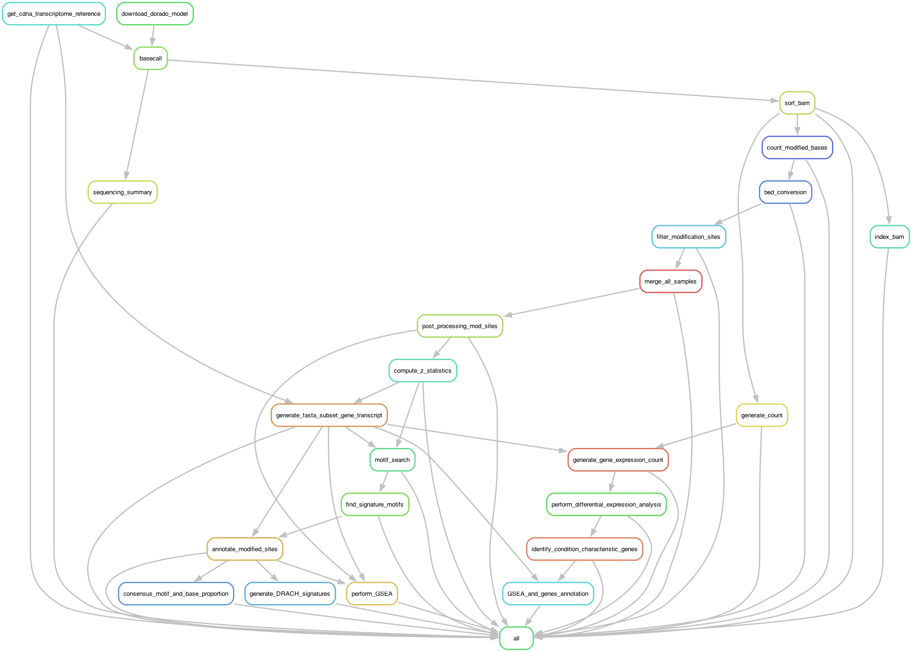
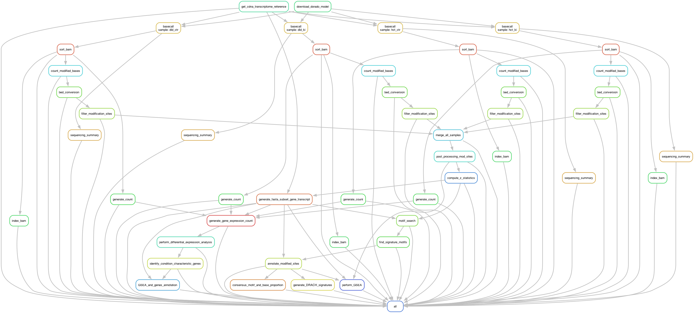

# nanopore_direct_rna_seq_pipeline
An end-to-end Snakemake pipeline for analyzing Oxford Nanopore direct RNA and DNA sequencing data, integrating Shell and R scripts. This pipeline automates the workflow from raw ionic signals to modification quantification, differential RNA or DNA modification, gene expression analysis, and downstream analyses, ensuring reproducibility and efficiency for nanopore long-read sequencing.

__Snakemake workflow__

Nanopore Direct RNA Sequencing Pipeline Tutorial
This pipeline is designed to process, analyze, and interpret direct RNA sequencing data from Oxford Nanopore sequencing technology. The workflow includes steps from raw data processing through base modification analysis, motif searching, differential expression analysis, and gene set enrichment. Here’s an overview of each stage.
	
Overview of Steps

Rule: download_dorado_model (Download Required Models)
The pipeline begins with downloading base-calling and modification-calling models required for analyzing RNA signals. These models are obtained from the Oxford Nanopore Dorado repository.

Rule: get_cdna_transcriptome_reference (Download Reference Transcriptome)
Retrieves the transcriptome reference file for Homo sapiens, needed for accurate alignment and annotation of the RNA sequences.

Rule: basecall (Base-calling the RNA Data; for each sample)
Base-calling converts raw ionic signal data into nucleotide sequences. Each sample is processed individually, producing sequence files for downstream analysis.

Rules: sort_bam and index_bam (Sort and Index BAM Files)
After base-calling, BAM files are sorted and indexed. Sorting arranges reads by genomic coordinates, facilitating efficient retrieval, and indexing enables quick access to specific genomic regions.

Rule: count_modified_bases (Count Base Modifications)
Counts specific modified bases (e.g., m6A) across the RNA sequences. This is crucial for understanding modifications in RNA molecules that may affect gene expression.

Rule: bed_conversion (Convert BED Files to RData Format)
Converts BED files of modification counts into RData format for compatibility with downstream analysis in R. This conversion allows efficient loading and processing in R-based scripts.

Rule: filter_modification_sites (Filter Modification Sites)
Applies filters to modification sites, removing those with insufficient read coverage or confidence levels. This ensures only high-confidence modifications are retained for further analysis.

Rule: merge_all_samples (Merge All Samples)
Combines data from all samples, identifying common modification sites across conditions. This step is essential for comparison between control and treatment groups.

Rule: post_processing_mod_sites (Post-process Modification Sites)
Conducts further processing on merged modification sites, such as calculating differential modification rates between conditions.
Rule: compute_z_statistics (Compute Z-statistics)
Computes statistical measures for modifications, including Z-scores, which help in identifying significantly modified sites.

Rule: generate_fasta_subset_gene_transcript (Generate Fasta Subset for Gene Transcript)
Extracts relevant sequences from the reference fasta file, creating a subset containing only the transcripts of interest based on detected modifications.

Rule: annotate_modified_sites (Annotate Modified Sites)
Annotates each modification site with gene and transcript information, providing context for each modification relative to genes.

Rules: motif_search and find_signature_motifs (Motif Search and Signature Detection)
These steps perform a targeted motif search to detect specific signature motifs that could indicate functional RNA elements or modifications.

Rule: consensus_motif_and_base_proportion (Identify Consensus Motifs and Base Proportions)
Calculates consensus motifs and base compositions for each modification site, identifying characteristic motifs that may play functional roles.

Rule: generate_DRACH_signatures (Generate DRACH Signatures)
Searches for DRACH or other signature motifs in the sequences, a well-known signature for m6A modifications, to validate the modification patterns observed.

Rule: generate_count (Generate Expression Counts)
Generates count tables of RNA transcripts for each sample, providing data for gene expression analysis.

Rule: generate_gene_expression_count (Generate Gene Expression Count Table)
Consolidates transcript counts into gene expression counts, yielding a summary table for RNA expression across genes.

Rule: perform_differential_expression_analysis (Perform Differential Expression Analysis)
Conducts a differential expression analysis to determine genes or transcripts with significant expression changes between control and treatment groups.

Rule: identify_condition_characteristic_genes (Identify Condition-characteristic Genes)
Identifies genes that are characteristic of each condition (control vs. treatment), potentially highlighting biomarkers or therapeutic targets.

Rules: GSEA_and_genes_annotation and perform_GSEA (Perform Gene Set Enrichment Analysis (GSEA) and Annotate Genes)
The final steps perform GSEA to identify enriched biological pathways and annotate genes. This provides insights into the functional implications of observed modifications and differential expressions.

Rule: all (Compile Results)
The all rule aggregates the outputs of each step, ensuring that all components of the analysis have completed successfully.

__Analysis overview__

For the analysis workflow and scripts, please contact tamalarafat@gmail.com